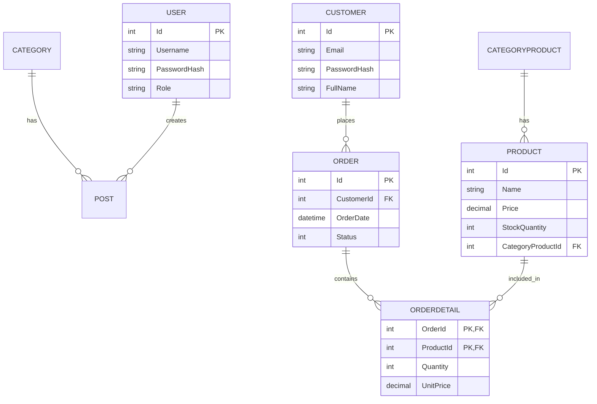

# BÁO CÁO THỰC HÀNH MÔN HỌC
**Tên Đồ Án:** Xây dựng Website Thương Mại Điện Tử & Tin Tức (ThinhCMS)
**Sinh viên thực hiện:** [Tên Của Bạn]
**Lớp:** [Lớp Của Bạn]

---

## MỤC LỤC
1. CHƯƠNG 1: TỔNG QUAN DỰ ÁN
2. CHƯƠNG 2: PHÂN TÍCH THIẾT KẾ HỆ THỐNG (ERD)
3. CHƯƠNG 3: CẤU TRÚC VÀ TÀI LIỆU WEB API
4. CHƯƠNG 4: XÂY DỰNG FRONTEND REACTJS
5. CHƯƠNG 5: QUẢN TRỊ BACKEND & PHÂN QUYỀN
6. CHƯƠNG 6: TỔNG KẾT VÀ ĐÁNH GIÁ TIẾN ĐỘ

---

## CHƯƠNG 1: TỔNG QUAN DỰ ÁN
Dự án ThinhCMS được xây dựng dựa trên mô hình 3 phân tầng chuẩn:
- **CMS.Data:** Quản lý Entity Framework Core và các models.
- **CMS.Backend:** Quản lý Controllers, Views (MVC) cho trang quản trị Admin và cung cấp Web API.
- **cms.frontend:** Ứng dụng Single Page Application (SPA) viết bằng ReactJS dành cho khách hàng.

Mục tiêu dự án là cung cấp đầy đủ tính năng: xem tin tức, xem danh mục sản phẩm, thêm vào giỏ hàng, đặt hàng, quản trị nội dung.

---

## CHƯƠNG 2: PHÂN TÍCH THIẾT KẾ HỆ THỐNG (ERD)

Sơ đồ ERD mô tả các mối quan hệ giữa các bảng trong cơ sở dữ liệu:



---

## CHƯƠNG 3: CẤU TRÚC VÀ TÀI LIỆU WEB API

Dưới đây là danh sách các API quan trọng cung cấp cho Frontend:

### 1. Lấy danh sách sản phẩm
- **Endpoint:** `GET /api/Products`
- **Mô tả:** Trả về danh sách sản phẩm.
- **Response JSON Mẫu:**
```json
[
  {
    "id": 1,
    "name": "Áo thun nam",
    "price": 150000,
    "imageUrl": "/uploads/aothun.jpg",
    "stockQuantity": 50
  }
]
```

### 2. Đặt hàng (Checkout)
- **Endpoint:** `POST /api/Orders`
- **Mô tả:** Nhận payload từ Checkout form và tạo đơn hàng.
- **Request Body JSON Mẫu:**
```json
{
  "customerId": 1,
  "notes": "Giao giờ hành chính",
  "orderDetails": [
    { "productId": 1, "quantity": 2 }
  ]
}
```

*(Lưu ý: Bạn hãy chụp ảnh màn hình giao diện Swagger API tại `https://localhost:7208/swagger` và kết quả test trên Postman rồi chèn vào phần này trong file Word).*

---

## CHƯƠNG 4: XÂY DỰNG FRONTEND REACTJS

Website Frontend bao gồm các màn hình chức năng chính sau:
1. **Trang Chủ (Home):** Hiển thị Header, Hero Banner, Danh mục nổi bật, Sản phẩm mới, Sản phẩm bán chạy.
2. **Trang Cửa hàng (Shop):** Liệt kê toàn bộ sản phẩm, cho phép lọc theo mức giá và từ khóa tìm kiếm.
3. **Trang Chi tiết Sản phẩm:** Xem hình ảnh, mô tả, tình trạng tồn kho và nút Thêm vào giỏ.
4. **Trang Tin tức (Blog):** Hiển thị các bài viết hướng dẫn phối đồ lấy mã HTML từ CKEditor.
5. **Trang Giỏ hàng (Cart):** Quản lý mảng sản phẩm đã chọn, điều chỉnh số lượng.
6. **Trang Thanh toán (Checkout):** Form nhập địa chỉ và nút Xác nhận đặt hàng.

---

## CHƯƠNG 5: QUẢN TRỊ BACKEND & PHÂN QUYỀN

- Tất cả các Controller quản trị (Category, Product, Order...) đều được bảo vệ bởi thuộc tính `[Authorize]`.
- Mật khẩu của Quản trị viên (User) và Khách hàng (Customer) đều được băm bằng thuật toán `BCrypt`.
- Chức năng thêm/sửa Bài viết tích hợp thành công CKEditor hỗ trợ định dạng HTML.
- Trang `_LayoutAdmin.cshtml` lấy linh động thông tin người dùng từ `Claims`.

---

## CHƯƠNG 6: TỔNG KẾT VÀ ĐÁNH GIÁ TIẾN ĐỘ

- Ứng dụng đã hoàn thiện đầy đủ 50 tiêu chí yêu cầu trong bài thực hành.
- Khó khăn gặp phải: Quản lý trạng thái Giỏ hàng (State Management) và xử lý bất đồng bộ khi gọi API mua hàng.
- Hướng phát triển: Thích hợp thêm cổng thanh toán VNPay/Momo, giao diện quản lý tình trạng giao hàng Realtime.
